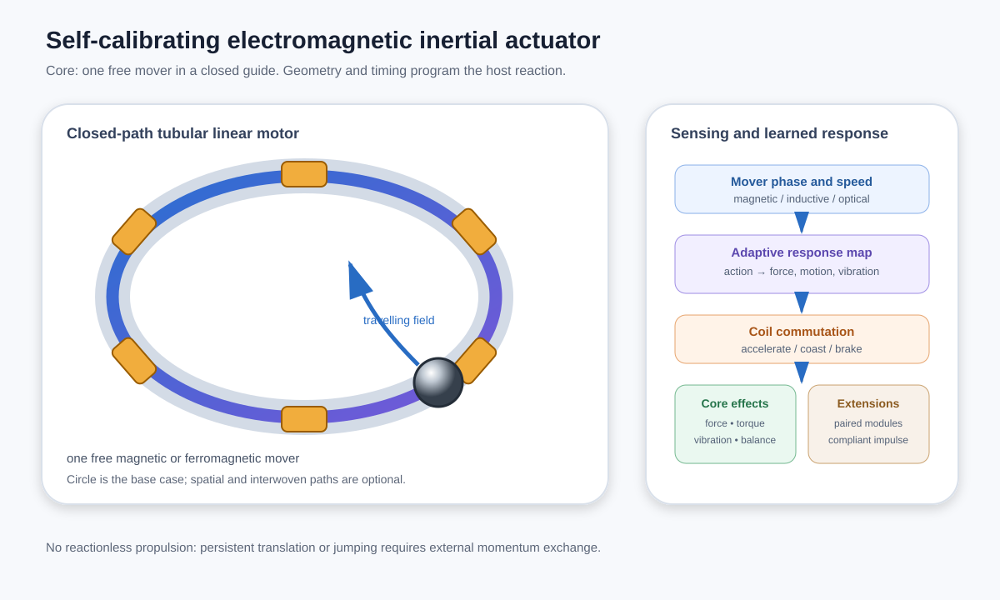
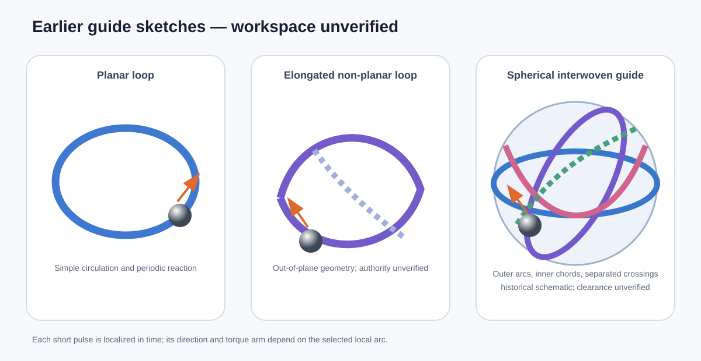

# Self-Calibrating Spatial Reaction-Mass Actuation Platform

**Status:** unvalidated concept; corrected working draft  
**Revision date:** 2026-09-20  
**Author / inventor:** Philipp Dik

The repository contains an earlier English edition recorded on 2026-09-17; the primary draft also carried 2026-09-16. Those historical labels do not establish a new release, verified first public disclosure date or patent priority. This revision incorporates the later four-path scope.

> Primary technical description: [`docs/description.md`](docs/description.md).

## Abstract

This repository records an unvalidated reaction-mass research proposal. The current candidate uses four independently controlled solid movers in four spatially offset, interwoven, oppositely twisted closed guide paths. Distributed actuation would select where and when each mover accelerates, coasts or brakes. Paired regions are intended to reduce unwanted reactions, while differential actions are intended to create selected host-body moments. The attainable compensation and three-axis torque authority have not been established. The four-path proposal targets attitude-control and stabilization experiments for aircraft or spacecraft.

The earlier one-mover circular or oval guide is retained as a component testbed. A separate ground spherical-robot concept uses three ring guides with one mover per ring; projected crossings require physical clearance. These are distinct embodiments, not a single validated mechanism.

A steel sphere is a convenient test mover, not a requirement of the concept. The current four-path proposal uses solid movers; it does not require liquid or plasma masses, magnetic suspension, a shared central chamber or a central four-channel synchronization node.

The proposed controller would learn a bounded empirical relationship between mover state, actuation and measured host response, then select actions within the available authority. Calibration and reaction-mass control are established methods. No prototype, measured performance dataset or validated simulation is supplied here.



*Conceptual one-mover testbed only; this does not depict the current four-path arrangement.*

## Proposed ground demonstrator: spherical mobile robot

A particularly intuitive prototype places the spatial reaction-mass system inside a rolling spherical shell. An optional externally mounted, magnetically coupled head-like module can remain visually upright while the main body rolls, giving the demonstrator a form factor reminiscent of familiar spherical character robots such as Sphero's BB-8 toy. The resemblance is only an external demonstration format; the internal actuation architecture described here is different.

Proposed experiments would assess rolling, steering, attitude response, rocking, vibration and contact impulses. With sufficient internal momentum change and correctly timed surface contact, selected reaction-mass actions may also increase the upward ground-reaction impulse and produce a **short hop** or hop-assisted obstacle traversal. This is a prototype objective rather than a guaranteed performance claim. In free flight, internal masses can redistribute attitude and angular momentum but cannot accelerate the isolated system's center of mass.

The same platform concept also applies to non-spherical hosts, linear shuttles, capsules, pendula, flywheels, multiple isolated movers, and hybrid mechanisms. The spherical robot is therefore a high-visibility example, not the definition of the proposed four-path architecture.

## 1. Technical field

The system relates to electromagnetic actuation, inertial and vibration control, surface-coupled locomotion, haptics, active balancing, motor integration, programmable reaction masses, and self-calibrating robotic devices.

## 2. Preferred electromagnetic embodiment

The earlier one-mover bench embodiment is proposed to contain:

1. A host body.
2. A closed guide fixed to the host.
3. One freely moving magnetic or ferromagnetic inertial element; a steel sphere is the preferred compact prototype mover.
4. Independently controllable electromagnetic sections distributed along the guide.
5. Sensors estimating mover phase, direction, and speed.
6. Power stages that apply local acceleration and controlled braking.
7. A controller that schedules those actions from a desired body response.
8. Body-state sensing, preferably an IMU and, when relevant, optical flow or another displacement reference.

The moving sphere is the translator of a closed-path tubular linear reluctance motor. The coils and magnetic circuit form its stator. A travelling field maximum is commutated ahead of the sphere for acceleration and removed or shifted before the sphere reaches a trapping field centre.

For a plain steel mover in a simple unsaturated reluctance model, force scales with current squared and the inductance gradient. Reversing current alone does not reverse attraction. Acceleration and braking require position-dependent commutation; force, sensing accuracy, electrical limits and heating remain to be measured. This is a proposed drive, not a validated motor design.

## 3. Position sensing

Position may be measured by magnetic, inductive, optical, capacitive, or combined sensors. A Hall sensor directly measures magnetic field, not ordinary steel itself. Hall sensing is straightforward when the mover is magnetized or contains a magnet. With a plain steel sphere, position may instead be inferred from perturbation of a biased magnetic field, from coil inductance, or from current/voltage response. Measurements may be taken during coil-current off-windows to reduce interference from the actuation field.

## 4. Force generation

For a point mover in a fixed, nonrotating guide, the incremental dynamic reaction on the host, with gravity excluded from this simplified expression, is:

```text
f_host,i = -m_i [sddot_i t_i + sdot_i^2 kappa_i n_i]
```

Here s is arc length, t is the local tangent, n is the curvature normal, and kappa is curvature. A moving or rotating host requires the full inertial acceleration, including origin acceleration, Coriolis, angular-acceleration and centrifugal terms. Gravity, rolling spin, contact couples, compliance and impacts must be treated consistently. The curvature term already represents the acceleration sustained by the guide constraint.

Simultaneous mover loads are summed at the same time and about a consistently defined reference O:

```text
F(t) = sum_i f_i(t)
torque_O(t) = sum_i [r_i(t) x f_i(t) + contact_couple_i(t)]
J = integral F(t) dt
K_O = integral torque_O(t) dt
```

Actions at different phases occur at different times. Their impulses and the resulting body dynamics must be integrated; they are not an instantaneous sum of forces. Varied tangents and lever arms do not by themselves establish a requested force-and-torque workspace.

## 5. Guide geometries

These earlier geometry sketches describe possible test paths, not proven control authority or the final four-path layout. Actual workspace depends on geometry, phase, dynamics and actuator limits.

### 5.1 Circular or oval guide

The simplest embodiment is a smooth closed loop. It is suitable for circulation, vibration, periodic impulse generation, active imbalance, and torque exchange. It is also the preferred geometry for an initial prototype.

### 5.2 Non-planar and elongated guide

A stretched or non-planar loop changes the available tangents and lever arms. Smooth elevation changes can provide paired phases with similar horizontal and different vertical reactions, allowing the controller to add or cancel normal-force modulation.

### 5.3 Multi-lobed or figure-eight guide

A figure-eight is one optional implementation, not the defining geometry. Its lobes provide separated lever arms and its projected crossing can be vertically separated. More general helical, knotted, or multi-lobed paths may be used when the desired force-and-torque workspace justifies additional mechanical complexity.

### 5.4 Spherical interwoven guide

An approximately spherical guide may be formed as a single continuous spatial curve woven through a three-dimensional volume. Some arcs may lie near the notional sphere surface, while inward-curving arcs or chord-like transitions pass through the interior and reconnect remote regions. This produces impulse sites whose tangents, curvature normals, and lever arms cover a wider three-dimensional set than a planar loop.

Apparent intersections do not require the mover to collide with another path segment. They may be:

- separated spatially as overpasses and underpasses;
- connected by smooth transitions belonging to one continuous route; or
- built as electromagnetically switched junctions that select one of several closed subroutes.

The controller would select feasible actions at particular phases. The combined model and measurements must establish the attainable workspace; neither non-planarity nor calibration guarantees an arbitrary reaction direction.



### Current four-path scope

The later proposal uses four spatially shifted, interwoven, oppositely twisted closed paths, each with its own solid mover. Paired regions are intended for coordinated circulation and differential acceleration/braking. The earlier central four-channel synchronization node is superseded.

No dimensioned four-path geometry is supplied. Physical separation, mover clearance and achievable compensation remain to be verified. The earlier switched-junction and single-route sketches are optional historical alternatives; they are not requirements of the current four separate paths.

## 6. Control modes

### 6.1 Continuous circulation

The mover maintains a nonzero baseline speed. Small speed changes around that baseline create controllable reactions without repeatedly starting from rest.

### 6.2 Impulse generation

The mover is slowed before a selected phase, accelerated through it, and then recovered with a lower-amplitude or differently timed action. Acceleration and braking are both usable control actions.

### 6.3 Distributed vibration or balancing

Actions are spread across several guide sections to create a requested vibration spectrum, counter an observed disturbance, change apparent imbalance, or smooth transient torque.

### 6.4 Surface-coupled locomotion

When the host contacts a surface, vertical reaction may unload or reload the contact while a horizontal reaction is applied. Asymmetric cycles can produce stick-slip translation or rotation.

### 6.5 Compliant-support impulse assistance

An earlier related application coordinates a guided mass, pendulum or flywheel with a spring, suspension, leg or other compliant support. The proposed sequence senses compression and schedules acceleration, braking or reversal around the rebound. Whether this increases the useful external impulse depends on the coupled dynamics, actuator limits and contact timing. No universal optimum immediately after the lowest point is asserted.

Recovery reactions must be included in the full contact cycle. Internal actuation alone cannot change the combined centre-of-mass trajectory during isolated flight.

### 6.6 Paired and counter-moving modules

Paired or counter-moving modules are proposed to reduce selected unwanted periodic reactions. Cancellation depends on mover mass, path geometry, phase, speed, acceleration and lever arm. Equal opposite speeds or zero summed angular momentum alone do not establish cancellation of force and torque.

Differential acceleration or braking can alter the host reaction, but the attainable command and residual vibration must be calculated and measured. Restoring phase or speed also produces reaction and must be included in the complete motion cycle.

### 6.7 Four-mover control limits

The current candidate has four separately guided movers with independently commanded acceleration and braking. Three-axis attitude authority is a design objective, not an established result.

At fixed mover phases and speeds, a point-mass model can write the instantaneous wrench as w = d + B u, with four scalar tangential-acceleration inputs. The 6-by-4 matrix B has rank at most four. Its torque submatrix must have rank three, with feasible bounded commands, before local three-axis torque control can be claimed. Additional force-cancellation constraints can consume the remaining input freedom; a fourth actuator is not automatically a spare degree of freedom for arbitrary phase recovery, collision avoidance or vibration suppression.

A six-component force-and-torque representation does not imply six independently controllable outputs. Special geometry or finite-time control may change the feasible task set, but both require analysis of the actual paths and limits. Tetrahedral travel directions alone are not a proof because moment arms also matter.

Internal redistribution may rebalance individual mover momentum and available control margin. It cannot change the isolated system's total angular momentum. External disturbance momentum requires external unloading where needed.

## 7. Self-calibration and adaptive control

For selected path phases and current profiles, the controller records:

- mover phase, direction, and speed;
- coil current, voltage, timing, and temperature;
- host acceleration and angular velocity;
- measured displacement and heading change;
- vibration and settling time;
- contact or suspension state when available;
- whether static friction, compliance, saturation, or an obstruction limited the response.

The controller builds and continuously updates a response map. It may begin with low-energy identification pulses, estimate the current operating envelope, retain a conservative baseline, and then select combinations of learned actions for translation, rotation, vibration, balancing, impulse assistance, or disturbance rejection.

An IMU measures body motion, not an arbitrary six-component actuator wrench directly. Inferring force and torque requires a suitable dynamics/contact model or independent measurements. Calibration cannot create missing authority or make indistinguishable support states uniquely observable. Detectable motion is not a safety threshold; identification must stay within separately established operating limits.

## 8. Localization and return behavior

An optical-flow sensor facing the support may estimate short-range planar motion. An IMU estimates rapid movement and attitude. Visual features, an infrared or magnetic marker, a radio beacon, or a physical dock can remove accumulated drift and allow return to a stored pose.

If the host is lifted and manually relocated, IMU and optical-flow dead reckoning alone do not provide absolute recovery. Environmental re-localization is required.

## 9. Integration into another motor or machine

The actuator may be integrated into the housing of a conventional electric motor, joint, wheel module, tool, appliance, or sealed machine as an additional controlled degree of freedom. The main motor produces shaft torque; the internal mover provides independently timed reaction, balancing, vibration cancellation, haptic output, transient-torque shaping, or diagnostic excitation.

The auxiliary actuator may share a housing and controller with the main motor while using a separate winding or magnetic-flux path. Reusing the same winding is possible only when the competing torque and mover-control requirements are magnetically and thermally compatible.

## 10. Example applications

Proposed applications, requiring separate validation, include:

- programmable directional vibration and haptic feedback;
- sealed or externally wheel-free surface motion;
- short-range self-positioning and return to a stored location;
- active balancing and compensation of changing payload;
- active imbalance cancellation in washing machines, centrifuges, rotating tools, and other appliances;
- vibration cancellation and structural excitation;
- transient torque smoothing in motors and joints;
- deliberate normal-force modulation at a contact;
- impulse assistance coordinated with suspension, springs, legs, flexures, or compliant mounts;
- three-dimensional reaction and attitude-control experiments using a spherical interwoven guide;
- paired counter-moving modules for vibration suppression and attitude control in aircraft or spacecraft;
- controlled attitude exchange in free flight, without a claim of reactionless propulsion;
- system identification by applying known internal impulses and observing the host response.


## 11. Proposed architecture and prior-art limits

The specific proposal under investigation is the four-path arrangement described above and its phase-dependent actuation policy. Generic internal masses, reaction wheels, acceleration/braking, adaptive response maps and paired compensation are not claimed as new.

Earlier patent disclosures already include four coordinated eccentric masses with adaptive compensation and tetrahedral multi-actuator layouts. Curved reaction-mass actuators with response characterization are also known. These are material prior art even though they do not establish the exact four interwoven non-planar guides proposed here. See [the prior-art review](docs/prior-art.md).

No conclusion of novelty, inventive step, freedom to operate or demonstrated performance is asserted. The absence of an identified exact equivalent is not evidence of novelty.

## 12. Physical limitations

The complete host-plus-mover system obeys external linear- and angular-momentum balance. Internal actuation cannot change the inertial trajectory of an isolated system's centre of mass. It can move the host relative to its internal masses and can change attitude; no reactionless translational thrust is claimed.

Surface locomotion and hopping require external support interaction. Slow or differently timed recovery does not remove the compensating internal reaction; the complete actuation and contact cycle must be analysed. A magnetorquer can unload spacecraft momentum only where a suitable external magnetic field is available; other missions require another external torque source.

## 13. Example prototype envelope

One non-limiting surface-coupled prototype may use:

- host mass: approximately 5–7 kg;
- available base envelope: approximately 295 × 205 mm;
- one bearing-steel sphere: approximately 40 mm diameter and 0.26 kg;
- closed guide length: approximately 0.75–0.85 m;
- mover speed: approximately 1.0–1.5 m/s;
- independently switched elongated coils: approximately 10–12;
- microcontroller, coil drivers, mover sensors, IMU, and optional optical flow.

These are unvalidated illustrative targets for the earlier one-mover bench concept, not measured performance and not specifications of the four-path module.

## 14. Prior-art context and publication purpose

See [docs/prior-art.md](docs/prior-art.md). The search is preliminary and is not a legal patentability opinion. This document is intended as a clear, dated technical disclosure. Public disclosure does not itself grant exclusive rights and may affect later patent protection. Obtain jurisdiction-specific legal advice before publication if patent protection is desired.

## Related work and terminology

The design uses established engineering terminology including **reaction mass**, **closed-loop guideway**, **distributed electromagnetic actuation**, **phase-selective actuation**, **system identification**, and **force/torque response map**. Related systems include fluid-actuated spherical robots with guided internal moving masses and electromagnetic magnetic-ball positioning systems; the closest references and explicit distinctions are summarized in [`docs/prior-art.md`](docs/prior-art.md).

## Citation

Citation metadata is provided in [`CITATION.cff`](CITATION.cff). The preferred citation identifies this material as a technical concept note.

